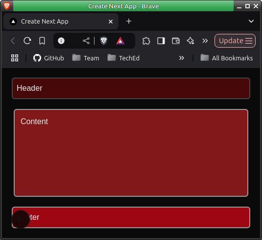
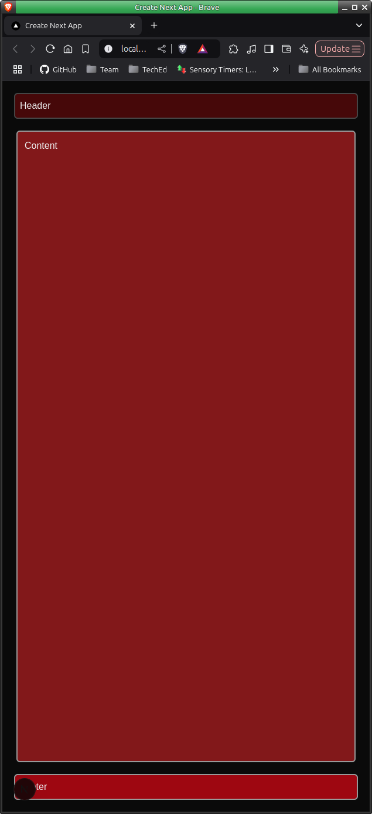

### Practice - basic styling

Sometimes just standing back and starting over will lead to what was wanted with no 'contamination'.

Below are two images of the browser window with notable absence of a scroll bar, changing the size of the browser window retains the application as intended'.

